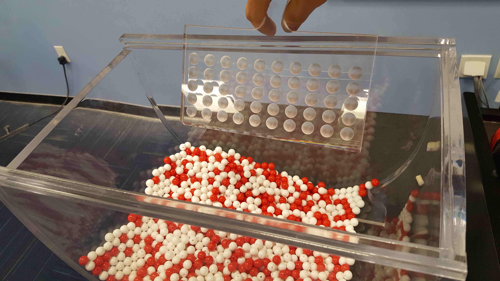

```{r setup, include=FALSE}
library(ggplot2)
library(dplyr)
library(readr)
library(scales)
library(knitr)
knitr::opts_chunk$set(echo = TRUE)

p <- 900/2400
n_samples <- 10^6
```

## The Exercise




# Recap

## 1. Hands on sampling exercise

In Lec 4.1

1. I had you all collect samples of size $n=50$ balls
1. We computed the *sample proportion red $\widehat{p}$* based on these samples

Here is what you got:

| |Group                     | red| white| green|  n| prop_red|
|--:|:-------------------------|---:|-----:|-----:|--:|--------:|
|  1|Kathleen and Max          |  18|    32|     0| 50|     0.36|
|  2|Sean, Jack, and CJ        |  18|    32|     0| 50|     0.36|
|  3|Orianna and Judy          |  22|    28|     0| 50|     0.44|
|  4|James and Jacob           |  21|    29|     0| 50|     0.42|
|  5|Hannah and Siya           |  16|    34|     0| 50|     0.32|
|  6|Niko, Sophie, and Caitlin |  14|    36|     0| 50|     0.28|
|  7|Niko, Sophie, and Caitlin |  19|    31|     0| 50|     0.38|
|  8|Aleja and Ray             |  20|    30|     0| 50|     0.40|
|  9|Yaw and Drew              |  16|    34|     0| 50|     0.32|
| 10|Yaw and Drew              |  21|    29|     0| 50|     0.42|


In Lec 4.2, we plotted a histogram of the 10 *sample proportions red* $\widehat{p}$ based on samples of size $n=50$.

```{r, message=FALSE, warning=FALSE, echo=FALSE}
responses <- read_csv("sampling_responses.csv") %>% 
  mutate(n=red+white+green) %>% 
  tibble::rownames_to_column(var="ID") %>%
  slice(2:n()) %>%
  mutate(prop_red = red/50) %>% 
  mutate(ID=1:n())

sampling_distribution <- ggplot(responses, aes(x=prop_red)) +
  geom_histogram(binwidth = 0.05) +
  labs(x="Sample proportion red in sample of size n=50", y="Number of samples",
       title="Sample proportion red in ten samples of size n=50") 
sampling_distribution
```
 
In Lec 5.1, I revealed that out of the 2400 balls, 900 are truly red. So the *true population proportion red* is $p=\frac{900}{2400} = 0.375$; let's mark this with a red line:

```{r, message=FALSE, warning=FALSE, echo=FALSE}
sampling_distribution +
  geom_vline(xintercept = p, col="red", size=1)
```


## 2. Sampling distribution

In Lec 5.1 I supposed the following hypothetical situation: I made Yaw and Drew do this **one million** times. The above histogram would look like

```{r, message=FALSE, warning=FALSE, echo=FALSE}
p_hats <- rbinom(n=10^6, prob = 900/2400, size=50)/50
sampling_distribution <- ggplot(data_frame(p_hat=p_hats), aes(x=p_hat)) +
  geom_histogram(binwidth = 0.02) +
  labs(x="Sample proportion red in samples of size n=50", y="Number of samples",
       title="Sample proportion red in ONE MILLION samples of size n=50") +
  geom_vline(xintercept = p, col="red", size=1) 
sampling_distribution
```

Very normal looking! So using general sampling terminology:

* The *population parameter* in this case is the *true population proportion red* $p=\frac{900}{2400} = 0.375$. 
* The *sample statistic AKA point estimate* in this case is the *sample proportion red* $\widehat{p}$ based on samples of size $n=50$. This quantity estimates $p$ via sampling.
* The above histogram is called the *sampling distribution of $\widehat{p}$ based on samples of size $n=50$*. It shows the variation in $\widehat{p}$ across different samples of size $n=50$. In this case, the sampling distribution is normally distributed with
    + Mean equal to $p=\frac{900}{2400} = 0.375$. In other words, the different values of $\widehat{p}$ based on different samples of size $n=50$ are *centered* around the true $p$.
    + Standard deviation equal to `r sd(p_hats) %>% round(3)` (and not 0.1 as stated at the end of Lec 5.1). This particular kind of standard deviation is called the *standard error*. It describes the typical error of our estimates $\widehat{p}$ based on different samples of size $n=50$ when trying to estimate $p$.

Since in this case this distribution is roughly normally shaped, we can use the rule that 95% of values fall within roughly $\pm 2$ standard deviations of the mean. In other words, $\widehat{p}$ based on samples of size $n=50$ will fall in the following interval roughly 95% of the time:

$$
[0.375 - 2\times0.068, 0.375 + 2\times0.068] = [0.239, 0.511]
$$
Recall that 2 standard deviations is a rule of thumb; the precise rule is: "If a distribution is normally distributed, then 95% of values fall within 1.96 standard deviations of the mean":

$$
[0.375 - 1.96\times0.068, 0.375 + 1.96\times0.068] = [0.242, 0.508]
$$


## 3. Playing with sample size $n$

Instead of samples of size $n=50$, let's set it to different values and see how

* the sampling distribution behaves
* the computed standard deviation of this sampling distribution called the *standard error* varies
* If the distribution is normal, then how the middle 95% of values vary (the blue dashed lines). This middle 95% is computed using the rule of thumb for normal distributions that the interval $\text{mean} \pm 1.96 \times \text{SD}$ contains 95% of values, where in this case
    + the $\text{mean}$ of the distribution is $p=\frac{900}{2400}=0.375$ (the red line)
    + the $\text{SD}$ standard deviation is the standard error

```{r, echo=FALSE}
inputPanel(
  sliderInput("n", label = "Sample size n: # of balls", min = 10, max = 500, value = 50)
)

renderPlot({
  n <- input$n
  set.seed(76)
  p_hat <- rbinom(n = n_samples, size = n, prob = p)/n
  SE <- sd(p_hat) %>% round(3)
  CI <- p + c(-1, 1)*1.96*SE %>% round(3)
  CI[1] <- round(CI[1], 3)
  CI[2] <- round(CI[2], 3)
  
  ggplot(data_frame(p_hat=p_hat), aes(x=p_hat)) +
    geom_histogram(bins=10) +
    coord_cartesian(xlim=c(0,1)) +
    geom_vline(xintercept=p, col="red", size=1) + 
    geom_vline(xintercept=CI, col="blue", linetype="dashed") + 
    scale_y_continuous(labels = scales::comma) +
    labs(
      x = paste("Sample proportion red in sample of size n = ", n, sep=""),
      y = "Number of Samples",
      title = paste("Sample proportion red in samples of size n = ", n, sep="")
      )
})

renderText({
  n <- input$n
  set.seed(76)
  p_hat <- rbinom(n = n_samples, size = n, prob = p)/n
  SE <- sd(p_hat) %>% round(3)
  CI <- p + c(-1, 1)*1.96*SE %>% round(3)
  CI[1] <- round(CI[1], 3)
  CI[2] <- round(CI[2], 3)
  
  paste(
    "The standard error is ", SE, 
    " and if the above sampling distribution is normal, then 95% of sample proportions based on samples of size n = ", 
    n, " will fall between [",
    CI[1], ", ", CI[2], "]",
    sep=""
    )
})
```


## 4. Interpretation of 95% confidence intervals

Recall to construct a confidence interval for $p$ we

1. Collect a sample of size $n$
1. Compute $\widehat{p}$
1. Compute the standard error  $\text{SE} = \sqrt{\frac{\widehat{p}(1-\widehat{p})}{n}}$
1. Compute the margin of error = $1.96\times\text{SE}$
1. Compute both end points of the confidence interval:
    + left: $\widehat{p} - 1.96\times\text{SE}$
    + right: $\widehat{p} + 1.96\times\text{SE}$

Let's do that for the data you collected where $n=50$ by adding 4 new columns for:

1. the standard error
2. the margin of error
3. the left endpoint of the confidence interval
4. the right endpoint of the confidence interval


```{r, echo=FALSE, message=FALSE, warning=FALSE}
sampling_responses <- read_csv("sampling_responses.csv") %>% 
  mutate(n = red+white+green) %>% 
  dplyr::filter(n == 50) %>% 
  select(Group, red, n) %>% 
  mutate(
    p_hat = red/n,
    SE = sqrt(p_hat*(1-p_hat)/n),
    MoE = 1.96*SE,
    left = p_hat - MoE,
    right = p_hat + MoE,
    y = 1:n()
  )
sampling_responses %>% 
  select(-y) %>% 
  kable(digits=3)
```

Let's plot these 10 confidence intervals for $p$:

```{r, echo=FALSE, message=FALSE, warning=FALSE}
groups <- sampling_responses$Group
ggplot(sampling_responses) +
  geom_point(aes(x=p_hat, y=y)) +
  geom_vline(xintercept=900/2400, col="red") +
  geom_segment(aes(y=y, yend=y, x=left, xend=right)) +
  scale_y_continuous(breaks=1:10, labels=groups) +
  labs(
    x = expression(p),
    y = "",
    title=expression(paste("95% confidence intervals for ", p, sep=""))
  )
```

We see that in all 10 cases, the confidence intervals "capture" the true $p = \frac{900}{2400} = 0.375$. Hooray! Let's say however, we repeated the above 100 times, not by actually doing it, but by simulations. What do I mean? Do this 100 times

1. Simulate collecting a sample of size $n=50$
1. Compute the confidence interval for $p$

Here are the results:

```{r, echo=FALSE, message=FALSE, warning=FALSE}
set.seed(79)
sampling_responses <- data_frame(
  p_hat = rbinom(n=100, prob = 900/2400, size=50)/50
) %>% 
  mutate(
    Group = 1:n(), 
    n=50,
    SE = sqrt(p_hat*(1-p_hat)/n),
    MoE = 1.96*SE,
    left = p_hat - MoE,
    right = p_hat + MoE,
    y = 1:n(),
    p = 900/2400,
    captured = left <= p & p <= right
  )

ggplot(sampling_responses) +
  geom_point(aes(x=p_hat, y=y, col=captured)) +
  geom_segment(aes(y=y, yend=y, x=left, xend=right, col=captured)) +
  labs(
    x = expression(p),
    y = "Sample ID number",
    title=expression(paste("95% confidence intervals for ", p, sep=""))
  ) +
  scale_color_manual(values=c("blue", "orange")) + 
  geom_vline(xintercept=900/2400, col="red") 
```

We see that of our 100 confidence intervals based on samples of size $n=50$, 95 of them captured the true $p = \frac{900}{2400}$, whereas 5 of them missed. Our procedure is "95% reliable."


