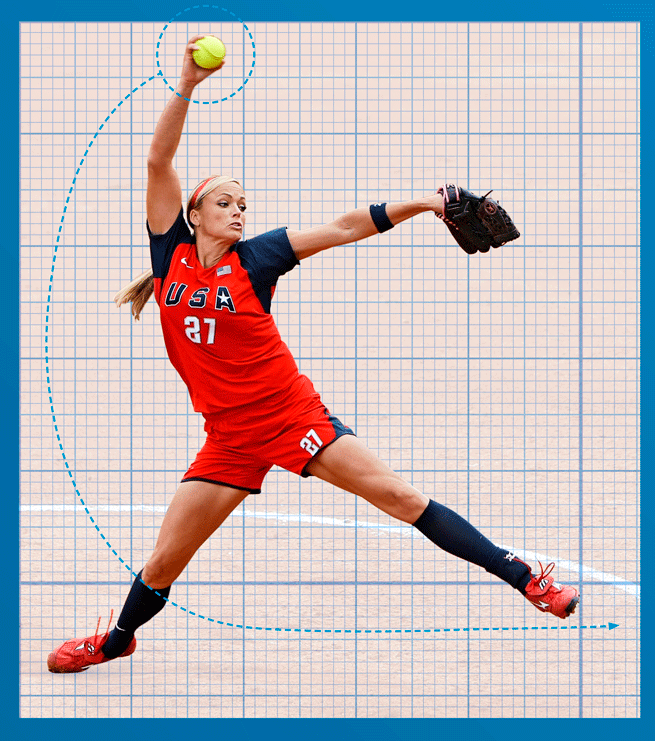
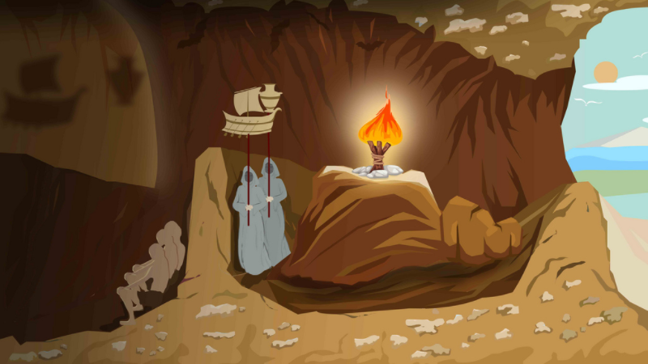
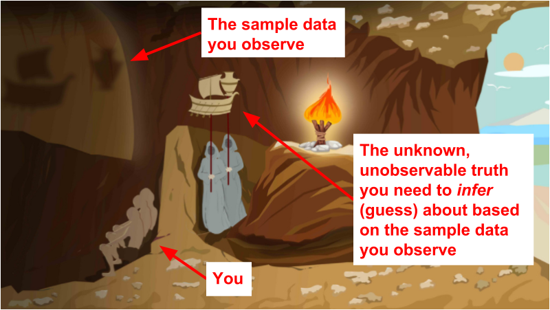

<style>
h2 { 
 color: #3399ff;		
}
h3 { 
 color: #3399ff;		
}
slides > slide.backdrop {
  background: white;
}
slides > slide:not(.nobackground):after {
  content: ""
}
</style>


```{r setup, include=FALSE}
knitr::opts_chunk$set(echo = FALSE)
```


# Objective 1 of 4

## Objective 1

Engage in the data/science research pipeline in as faithful a manner as possible while maintaining a level suitable for novices.


## Course title

> * **Official title**: Introduction to Statistics via Modeling
> * **Unofficial title**: Introduction to **Data Science** and Statistics via Modeling


## What is data science?

Domains include: Neuroscience, polisci, environmental studies, econ, biology, ...


## Why? Dialogue with student...

<!--
Hi professor, I really liked your intro stats class. Can I ask you a stats question on a bio project I'm working on? I have gene expression data in this excel file. How would I run some of the methods we learned in class on it?
http://www.ios7text.com/em78xa
-->

> 


## Engage in the data/science research pipeline in as faithful a manner as possible...

In other words, engage with all of this...

> 


## Engage in the data/science research pipeline in as faithful a manner as possible...

... and not just this.


## ... while maintaining a level suitable for novices

We'll be engaging in a **simplified version of the whole** data/science pipeline. Think how children learn "tee-ball" and "play the whole game" first...


## ... while maintaining a level suitable for novices

... and then eventually graduate to softball/baseball.

 


# Objective 2 of 4

## Objective 2

Develop the toolbox necessary to "think with data":

* Data science
* Data modeling
* Statistical inference


## Data visualization


## Data modeling

Data modeling for

* Explanation: When does $x$ cause $y$?
* Prediction: Based on $x$, can I make good predictions about $y$?

Latter is used in the booming field of *machine learning*:


## Statistical inference

> * Statistical inference is the act of infering about some unknown by taking a sample.
> * But what is inference?


## What is inference?

Plato's allegory of the cave




## What is inference?

Plato's allegory of the cave


## What is inference?

Plato's allegory of the cave


## What is inference?

Plato's allegory of the cave




# Objective 3 of 4

## Objective 3

Take your first steps coding.

Two possible "engines" for this class:

* Mathematics: formulas, approximations, etc
* Computers: simulations, random number generation 

We're going to focus on the latter. What does this mean?


## In this class

Less of this:  | But more of this:
------------- | -------------
  |  


## Coding

> * Previous coding experience is not a prerequisite! This is not a computer science course!
> * Never code from scratch: the "cut/paste/tweak" approach.
> * Most important: learing to code is like learning a new language <center></center>


## Bigger picture

> * 20th century *basic skills*:  Reading, writing, quantitative reasoning
> * 21st century *basic skills*:  Reading, writing, quantitative reasoning, **and coding**


# Objective 4 of 4

## Objective 4

Develop your statistical literacy, a necessary ability for effective citizenship.


## Famous quote

[H.G. Wells](https://www.quora.com/What-is-the-source-of-the-H-G-Wells-quote-Statistical-thinking-will-one-day-be-as-necessary-for-efficient-citizenship-as-the-ability-to-read-and-write): 

"Statistical thinking will one day be as necessary for efficient citizenship as the ability to read and write."

## Producers vs consumers

> * Some of you might become **producers** of statistics: at work, in your research, etc.
> * But all of you will become **consumers** of statistics: reading the news


## Statistical citizenship 

<center>
<blockquote class="twitter-tweet" data-lang="en"><p lang="en" dir="ltr">I gave a TED talk on 3 ways to spot a bad statistic. I really hope you like it <a href="https://t.co/IjijWfyRTk">https://t.co/IjijWfyRTk</a> <a href="https://t.co/36BJZrpirx">pic.twitter.com/36BJZrpirx</a></p>&mdash; Mona Chalabi (@MonaChalabi) <a href="https://twitter.com/MonaChalabi/status/845298780886978560">March 24, 2017</a></blockquote>
<script async src="//platform.twitter.com/widgets.js" charset="utf-8"></script>
</center>
