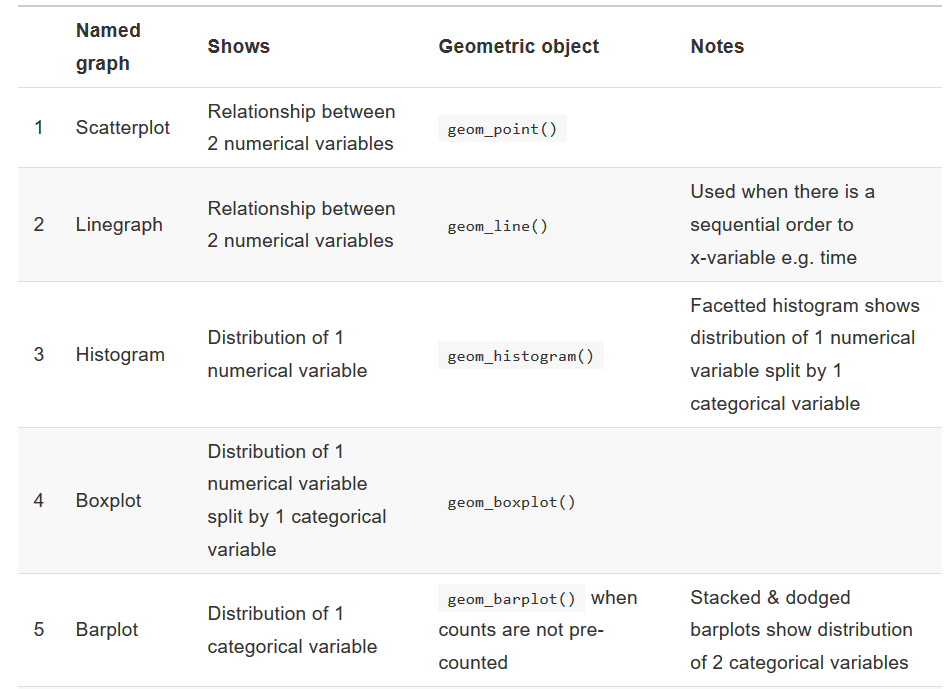

---
title: "Data Visualization"
output:
  html_document:
    css: lab.css
    highlight: pygments
    theme: cerulean
    toc: yes
    toc_float: yes
---


```{r, include = FALSE, message = FALSE}
library(ggplot2)
library(dplyr)
library(nycflights13)
library(readr)
```

{width=50%}


---

Read through the lab, and work through the **Exercises**  below. You can open an R scratchpad file to do this work, and copy, paste, and tweak code exmaples from this lab. You do not need to turn anything in, but this will be a good review for your midterm, so ask questions and work through this! 

## Why use the `ggplot2` package?

Throughout the semester we will use the `ggplot2` package to generate graphics. It has a number of advantages to other graphics packages:

-   consistent underlying grammar of graphics 
-   plot specification at a high level of abstraction
-   very flexible
-   theme system for polishing plot appearance (not yet in this lab!)
-   mature and complete graphics system
-   many users, and an active mailing list

### What Is The Grammar Of Graphics?

The "The Grammar of Graphics," is the theoretical basis for the `ggplot2` package. Much like how we construct sentences in any language by using a linguistic grammar (nouns, verbs, etc.), the grammar of graphics allows us to specify the components of a statistical graphic.

In short, the grammar tells us that:

> A statistical graphic is a `mapping` of `data` variables to `aes`thetic attributes of `geom`etric objects.

We can break a graphic into the following three **essential** components:

-   `data`: the data-set comprised of variables that we plot
-   `geom`: this refers to our type of `geom`etric objects we see in our plot (points, lines, bars, etc.)
-   `aes`: aesthetic attributes of the geometric object that we can perceive on a graphic. For example, x/y position, color, shape, and size. Each assigned aesthetic attribute can be mapped to a variable in our data-set.

There are other components of the Grammar of Graphics we can control. For now, we'll only work with the two other components below:

-   `facet`ing breaks up a plot into small multiples corresponding to the levels of another variable 
-    `position` adjustments for barplots 

<br>

## Getting set up

We will practice data visualization using some flights and weather data collected by the [Bureau of Transportation Statistics](http://www.rita.dot.gov/bts/about/), and stored in the `nycflights13` package. The different packages we will be using today are listed below. You may need to *install* some of these packages if you are working on the R Studio **Desktop** and have not used them before in R.

```{r eval=FALSE}
library(ggplot2)          # For data visualization
library(dplyr)            # For data manipulation
library(nycflights13)     # For built-in data sets
```


Then load the flights data stored in the `nycflights13` package, and look at the data. 
```{r, results = "hide"}
data(flights)
head(flights)
```

The data set `flights` that shows up in your Environment is a large **data frame**. Each *observation* is a single flight.

To view the names of the variables, type the command

```{r names, results = "hide"}
names(flights)
```

This returns the names of the variables in this data frame. A description of the variables can be accessed by typing `?flights` **into your console** and hitting Enter.

It is also good practice to look at the data frame to see its dimensions and data types. 

```{r str, eval = FALSE}
glimpse(flights)
```

<br>

## Types of Graphs
We will explore three different types of graphs today. 

    scatterplots
    boxplots
    histograms
   
With this basic repertoire in your toolbox you can visualize a wide array of different variable types. You'll want to quiz yourself often as we go along on which plot makes sense a given a particular problem or data-set.

<br>

###  Scatterplots
Scatterplots allow you to investigate the relationship between two **numerical** variables. While you may already be familiar with this type of plot, let's view it through the lens of the Grammar of Graphics. Specifically, we will graphically investigate the relationship between the following two numerical variables in the flights data frame:

-   `dep_delay`: departure delay on the horizontal "x" axis and
-   `arr_delay`: arrival delay on the vertical "y" axis

We will first pare down the flights data frame to a smaller data frame consisting of only flights on Alaskan Airlines (code "AS") . Type and run the following code into your lab template: 

```{r}
flight_sub <- flights %>% 
  filter(carrier == "AS")
```

This command takes the `flights` data frame and `filter`s it to only return the rows which meet the condition `carrier == "AS"`. We used the `<-` assignment operator to store the new, smaller, data as an object called `flight_sub`. 


<div id="license">
A note on logical operators: Filtering for a subset of observations (e.g. flights from a particular airport) is a common task. To do so we use the filter function and a series of logical operators. The most commonly used logical operators for data analysis include:

    == means "equal to"
    != means "not equal to"
    > or < means "greater than" or "less than"
    >= or <= means "greater than or equal to" or "less than or equal to"
</div>


Now, create a scatterplot using the `ggplot` function. 
```{r, eval = FALSE}
ggplot(data = flight_sub, mapping = aes(x = dep_delay, y = arr_delay))+ 
  geom_point()
```

Let's view this plot through the grammar of graphics. Within the `ggplot()` function call, we specified:

-   The data frame to be `flight_sub` by setting `data = flight_sub`
-   The `aes`thetic `mapping` by setting `aes(x = dep_delay, y = arr_delay)`
-   The variable `dep_delay` maps to the `x`-position `aes`thetic
-   The variable `arr_delay` maps to the `y`-position `aes`thetic.

We also add a layer to the `ggplot()` function call using the `+` sign. The layer in question specifies the `geom`etric object here as `point`s,  by specifying `geom_point()`.

<br>


2.  Filter the `flights` data to make a new data set called `delta_flights` that only include flights on Delta Airlines (code "DL"). Make a graph showing `distance` on the x axis and `air_time` on the y axis for the  `delta_flights` data set. Is there a positive or negative relationship between these variables? Add an argument mapping the variable `origin` to the `color` of the points (`color = origin` goes inside the `aes`thetic argument). Out of which airport in New York does Delta make the longest flights?

```{r, include = FALSE}
delta_flights <- flights %>% 
  filter(carrier == "DL")

ggplot(data = delta_flights, mapping = aes(x = distance, y = air_time, color = origin))+ 
  geom_point()
```

<br>

### Histograms 
Histograms are useful plots for showing how many elements of a **single numerical** variable fall in specified bins. This is one way to get a sense of the *distribution* of your data. Histograms are often one of the first steps in exploring data visually. 

We will load some weather data from the `nycflights13` package to explore histograms. Each row in this data set is an hourly measurement of numerous weather variables at New York City airports. Load the data and check it out with these commands. Remember you can also get information about the data by typing `?weather` in the console. 

```{r, eval = FALSE}
data(weather)
head(weather)
glimpse(weather)
```

<br>

To look at the distribution of temperatures recorded with a histogram type the following

```{r, eval = FALSE}
ggplot(data = weather, mapping = aes(x = temp)) +
  geom_histogram() 
```

A few things to note here:

-   There is only one variable being mapped in `aes()`: the single numerical variable `temp`. You don't need to compute the `y`-`aes`thetic: it gets computed automatically.
-   We set the geometric object as `geom_histogram()`
-   We got a warning message about removing a row because one temperature value was missing (NA). 
-   Another warning message encourages us to specify the number of bins on the histogram, as R chose 30 for us. 

We can change the binwidth (and thus the number of bins), as well as the colors like so:
```{r, eval = FALSE}
ggplot(data = weather, mapping = aes(x = temp)) +
  geom_histogram(binwidth = 20, color = "tomato", fill = "tan")
```

Note that none of these arguments went inside the `aes`thetic `mapping` argument as they do not specifically represent mappings of variables. 

Finally, we can change/and add labels to the plot by adding a `labs()` argument like so
```{r warning = FALSE, message = FALSE}
ggplot(data = weather, mapping = aes(x = temp)) +
  geom_histogram(binwidth = 20, color = "tomato", fill = "tan") + 
  labs(x = "Temperature (degrees F)", y = "Count", 
       title = "New York City Airport Temperatures 2013")
```


<br>

4. Change the colors of the temperature histogram. Type `colors()` in your console (and hit `Enter`) to see the available colors. Explore different values for the `binwidth` argument. What do you think is the "center" value of this distribution? 

5. Make a histogram of dewpoint from the `weather` data set. Use `names(weather)` to see the variable names, and `?weather` to see a description of the data set. Make sure you label your axes and give your plot a useful title. 

```{r, eval = FALSE, include = FALSE}
ggplot(data = weather, mapping = aes(x =dewp)) +
  geom_histogram(binwidth = 10, color = "tomato", fill = "tan")
```


<br>

Let's also review a useful concept called **faceting**. Faceting is used when we'd like to create small multiples of the same plot over a different categorical variable. By default, all of the small multiples will have the same vertical axis.

For example, suppose we were interested in looking at how the temperature histograms varied by month. This is what is meant by "the distribution of one variable over another variable": `temp` is one variable and `month` is the other variable. In order to look at histograms of `temp` for each month, we add a plot layer `facet_wrap(~ month)`. 

```{r, eval = FALSE}
ggplot(data = weather, mapping = aes(x = temp)) +
  geom_histogram(binwidth = 5, color = "tomato") +
  facet_wrap(~ month)
```

Note the use of the `~` before `month`. Excluding the tilde will cause an Error. 

<br>

5. What do the numbers 1-12 correspond to in this graph? In which month does temperature appear to be the least variable? In which month does the distribution of temperatures look the most right skewed? Left skewed?


<br>


### Boxplots

While histograms can help to show the distribution of data, boxplots have much more flexibility, and can provide even more information in a single graph. The y `aes`thetic is the numeric variable you want to include in the boxplot, and the x `aes`thetic is a grouping variable. For instance, below we set the `origin` variable, which identifies the weather station as the `aes`thetic `mapping` for x. This creates a boxplot of temperatures at the different airport weather stations:

```{r, eval = FALSE}
ggplot(data = weather, mapping = aes(x = origin, y = temp)) +
  geom_boxplot()
```

Since the `aes`thetic mapping wants a grouping variable for x, we can put in a single value for x to make a boxplot for all values of a variable. For insance, here we use `x = NULL` to make a boxplot of temperature accross all weather stations. 

```{r, eval = FALSE}
ggplot(data = weather, mapping = aes(x = NULL, y = temp)) +
  geom_boxplot()
```

<br> 

Run the code below to make boxplots of `temp` across the different months. Note that we get a warning message, and a single boxplot, rather than one for each month. What happened?

```{r echo=TRUE, fig.height=3, fig.width=4,  include = TRUE}
ggplot(data = weather, mapping = aes(x = month, y = temp)) +
  geom_boxplot(fill = "lightblue")
```

<br>

The warning reminds us that month is a continuous variable not a factor! `ggplot()`cannot use a numeric variable as x. This is why it is important to take a `glimpse()` of your data when you start!
 
<br>

We can fix this by converting `month` to a factor with the `factor()` argument, as below.  
```{r eval = FALSE}
ggplot(data = weather, mapping = aes(x = factor(month), y = temp)) +
  geom_boxplot(fill = "lightblue")
```

The plot that is generated shows a boxplot for each month. 


<div id="license">
For review, these are the different parts of the boxplot: '

-   The bottom of the "box" portion represents the 25th percentile (1st quartile)
-   The horizontal line in the "box" shows the median (50th percentile, 2nd quartile)
-   The top of the "box" represents the 75th percentile (3rd quartile)
-   The height of each "box", i.e. the value of the 3rd quartile minus the value of the 1st quartile, is called the interquartile range (IQR). It is a measure of spread of the middle 50% of values. Longer boxes indicating more variability.
-   The "whiskers" extending out from the bottoms and tops of the boxes represent points less than the 25th percentile and greater than the 75th percentiles respectively. They extend out **no more than** 1.5 * IQR units away from either end of the boxes. We say "no more than" because the ends of the whiskers represent the first observed values of `temp` to be within the range of the whiskers. The length of these whiskers show how the data outside the middle 50% of values vary. Longer whiskers indicating more variability.
-   The dots represent values falling outside the whiskers or outliers. The definition of an outlier is somewhat arbitrary and not absolute. In this case, they are defined by the length of the whiskers, which are no more than 1.5 * IQR units long.
</div>

<br>

7. In which month is the median temperature just over 50 degrees? Which month is the least variable? Compare these boxplots to the histograms showing the same data faceted by month. What kind of pattern on the boxplots indicates a right skew? Left skew?


8. Pick a different weather variable in the `weather` data show as a boxplot, across different `hour`s of the day (i.e. one boxplot for each hour of the day). **Hint:** what function did we use above to see the names of the variables in our data set?

```{r include = FALSE}
names(weather)
ggplot(data = weather, mapping = aes(x = factor(hour), y = humid)) +
  geom_boxplot(fill = "lightblue")
```

<br>

--------

## More practice

9. Load, inspect, and read about the `planes` data included in the `nycflights` package. Choose a data visualization to make with the data.  Use the code examples above to help. The table below should also help you think about what kind of plots are relevant for which types of variables (note: we did not cover linegraphs).


<br>




Table 3.5 from Modern Dive 
http://moderndive.netlify.com/index.html


<br>

------


<font size="1">
<div id="license">
This lab was adapted from the Modern Dive textbook, 
http://moderndive.netlify.com/index.html
by Jenny Smetzer.
</div>

* * *
